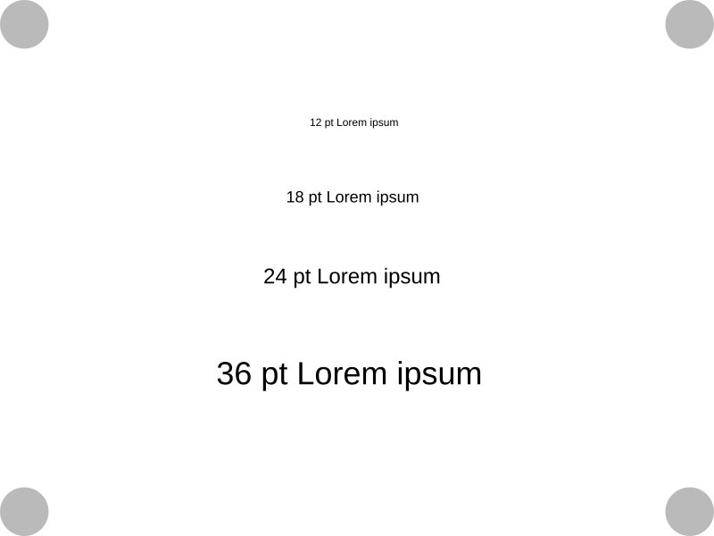
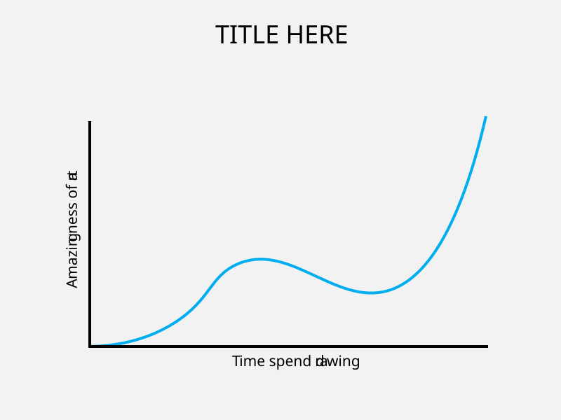
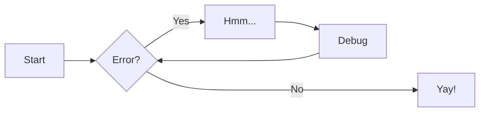

# Features & Extensions

This page demonstrates the features enabled in the default `zensical.toml` of **doc-skeleton**. Zensical separates configuration into three categories:

- Built-in plugins are enabled under `[project.plugins]`, for example `[project.plugins.awesome-nav]`.
- Markdown extensions are enabled under `[project.markdown_extensions]`, for example `footnotes = {}`.
- Theme features are enabled in the `features` list under `[project.theme]`.

Supported plugins and Markdown extensions are included with Zensical unless their documentation explicitly requires another package.

## Navigation with awesome-nav

The built-in `awesome-nav` plugin is enabled with:

```toml
[project.plugins.awesome-nav]
```

Navigation is configured with `.nav.yml` files inside `docs/` and its subdirectories. For example:

```yaml title="docs/some/dir/.nav.yml"
nav:
  - filename.md
  - another_file.md
  - directory
  - another_dir
  - "*"
  - last_file.md
```

Use `"*"` to include files and directories that have not been listed explicitly. The asterisk must be quoted because it has a special meaning in YAML.

## Text-related features

The following features are enabled under `[project.markdown_extension]`.

### Emojis

Emoji shortcodes are enabled by the configuration:

```toml
pymdownx.emoji.emoji_index = "zensical.extensions.emoji.twemoji"
pymdownx.emoji.emoji_generator = "zensical.extensions.emoji.to_svg"
```

Write an emoji shortcode such as `:smiley:` to render :smiley:.

See [Icons and Emojis](https://zensical.org/docs/authoring/icons-emojis/).

### Footnotes

Footnotes are enabled with:

```toml
footnotes = {}
```

Add a reference such as `[^example]` to the text and define it elsewhere with `[^example]:`. Here is one footnote reference [^example].

### Highlighting and text formatting

Various text formatting features are enabled with e.g.:

```toml
pymdownx.caret = {}
pymdownx.mark = {}
pymdownx.tilde = {}
pymdownx.keys = {}
```
Examples are:

- This is a caret (underlining): ^^insertion^^.
- This is a mark: ==highlight==.
- This is a tilde (deletion): ~~deletion~~.
- This is a key: ++ctrl+alt+del++.

### Task lists

Task lists and custom checkboxes are enabled with:

```toml
pymdownx.tasklist.custom_checkbox = true
```

Example:

- [x] Create the*course repository
- [x] Update the site*configuration
- [x] Add the*course content
- [ ] Publish the site

## Code blocks

### Syntax highlighting

Syntax highlighting is configured with `pymdownx.highlight`, while fenced and inline code are enabled*with `pymdownx.superfences` and `pymdownx.inlinehilite`.

The copy and annotation buttons are theme features:

```toml
[project.theme]
features = *
    "content.code.annotate",
    "content.code.copy",
]
```

Example:

```python title="example_code.py"
import os

platform_name = os.name # (1)
print(platform_name)
```

1. :cat: Code annotations can contain formatted markdown.

Syntax highlighting supports the languages available in [Pygments](https://pygments.org/languages/)

### Content tabs

Content tabs are enabled with:

```toml
pymdownx.tabbed.alternate_style = true
```

They also rely on `pymdownx.superfences` when tabs contain fenced code blocks.

=== "C"

    ``` c
    #include <stdio.h>

    int main(void) {
      printf("Hello world!\n");
      return 0;
    }
    ```

=== "Python"


    ```python
    def main():
        print("Hello world!")
    ```


## Admonitions

Admonitions are enabled with:

```toml
admonition = {}
pymdownx.details = {}
```

The `admonition` extension provides regular admonitions beginning with `!!!`. The `pymdownx.details` extension provides collapsible admonitions beginning with `???`.

!!! tip "Tip"

    Use `!!! tip "Title"` to create an admonition with a custom title.

!!! question "Exercise"

    The `question` type is useful for exercises and assignments.

??? note "More information"

    Use*`??? note` to create a collapsed block that the reader can open.

!!! quote

    The way to get started is to quit talking and begin doing. *Walt Disney*

The body of an admonition must be indented by four spaces.

## Images and glightbox

Use relative paths for local images and prefer SVG for diagrams and illustrations. A solid light background helps keep text and lines visible in both light and dark modes.

The built*in `*lightbox` plugin is enabled with:

```toml
[project.plugins.glightbox]
```

It makes rendered images clickable. Select the image below to open the pop-up lightbox.



**Figure 1:** *An example SVG illustration. Note that the image is an SVG with small dimensions. Thus, the image in the lightbox will be displayed with a smaller size than on the page, which uses percentage-based sizing.*

## Affinity Designer

Enable **Force Pixel Alignment** while creating the artwork. Export the finished image with the `SVG (for export)` preset.

### Adobe Illustrator

Create the document with these settings:

- Units: Pixels
- Color mode: RGB
- Preview mode: Pixel

Enable `View > Snap to Pixel`.

Export the finished artwork with `File > Export > Export As... > SVG`. Enable **Minify** and **Responsive**. One decimal place is usually sufficient when shapes have been aligned to the pixel grid.

### Excalidraw

Excalidraw diagrams can be exported as SVG or PNG. Keep the original `.excalidraw` file in `docs/images/` so the diagram can be edited later. You could also use Excalidraw Extension on VS Code, but that is outside the scope of this example.

When exporting PNG files, enable the background. Transparent background may make text or lines difficult to see in dark mode.

## Diagram example

The diagram below is an SVG with a light background. Select it to open it with `glightbox`.



**Figure 2:** *Line diagram showing the relationship between time spent and the quality of artwork*

## Mermaid diagrams

Mermaid diagrams are a type of diagram that can be created using a simple text-based syntax. They are particularly useful for creating flowcharts, sequence diagrams, and other types of diagrams. Their rendering is enabled with the `pymdownx.superfences` extension, which allows for custom fenced code blocks:

```toml 
[project.markdown_extensions]
pymdownx.superfences.custom_fences = [
  { name = "mermaid", class = "mermaid", format = "pymdownx.superfences.fence_code_format" },
]
```

Create a diagram with a fenced code block named `mermaid`:



See the [Mermaid documentation](https://mermaid.ai/open-source/syntax/examples.html) for more examples.

## Features outside this template

Features such as LaTeX and MathJax are not configured in the basic **doc-skeleton** template. Project-wide additions and configuration synchronization are handled separately by [doc-flesh](https://github.com/sourander/doc-flesh).

[^example]: *This footnote is rendered because `footnotes = {}` enables the Python Markdown Footnotes extension.*